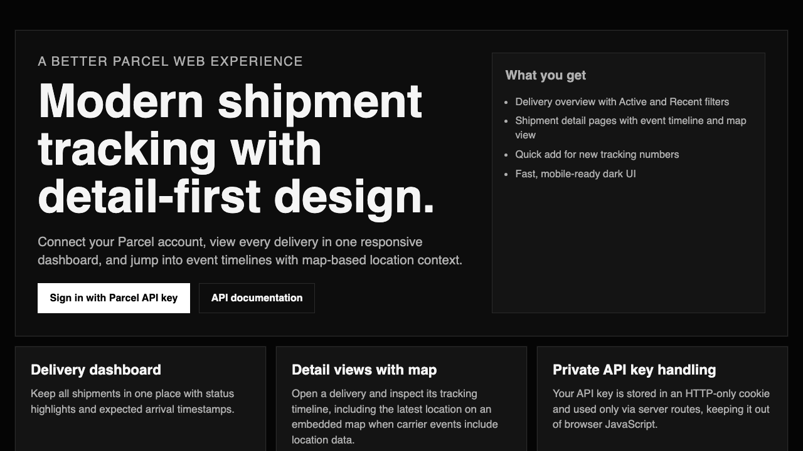

# Better Parcel Web

A modern Parcel web UI built with TanStack Start.

## Landing Page



## Features

- Landing page with clear sign-in CTA
- Sign-in flow with Parcel API key (stored in an HTTP-only cookie)
- Authenticated app page for:
  - Viewing deliveries (`active` or `recent`)
  - Adding a new delivery
- Server-side API proxy routes so the Parcel API key is never exposed in browser JS

## Routes

- `/` Landing page
- `/sign-in` API key sign-in
- `/app` Deliveries dashboard
- `/api/session` Session create/destroy
- `/api/deliveries` Delivery fetch proxy
- `/api/add-delivery` Add delivery proxy

## Local Development

```bash
pnpm install
pnpm dev
```

Open [http://localhost:3000](http://localhost:3000).

Requires Node.js `20.19+` (or `22.12+` / newer) for Vite 7.

## Deploy on Cloudflare Workers

1. Log in to Cloudflare:
```bash
pnpm dlx wrangler login
```
2. Verify auth:
```bash
pnpm dlx wrangler whoami
```
3. Build and deploy:
```bash
pnpm run deploy
```

This project uses Wrangler + Cloudflare Vite plugin for deployment.
No extra environment variables are required for Parcel integration because users sign in with their own API key.

## Parcel API docs

- [Overview](https://parcel.app/help/api.html)
- [View deliveries](https://parcelapp.net/help/api-view-deliveries.html)
- [Add delivery](https://parcelapp.net/help/api-add-delivery.html)
